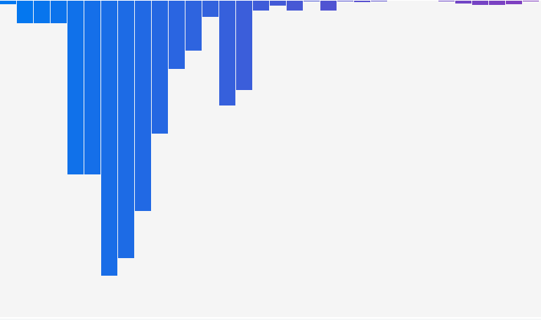

# Prism

A GPU-rendered music visualizer built in C, inspired by [cava](https://github.com/karlstav/cava).

---

Prism performs real-time FFT analysis on system audio and renders a smooth, logarithmically scaled frequency spectrum with user configurable decays, colors and gradients.

The project uses:
* [miniaudio](https://miniaud.io/docs/manual/index.html)
   - To capture background audio
* [KissFFT](https://github.com/mborgerding/kissfft) 
   - As a library for the fast fourier transform
* [raylib](https://www.raylib.com/)
   - As the GUI library to display the visualiser

## Background
The project is a spiritual successor of an earlier project, [spectra-view](https://github.com/vedjain773/spectra-view) which served as an educational / foundational project compared to Prism. During the development of spectra-view I pretty much wrote each part of the pipeline from scratch (WAV file parsing and decoding, DFT calculation and the rendering of the bars on the terminal) which solidified my fundamentals pretty well and taught me a lot about signal processing and encoding.

This did come with its drawbacks though, since the program was really slow and took minutes to run the DFT on even 8-10 second long WAV files. A major cause of the sluggish speed was the naive DFTI used which required significantly more operations than the FFT to get the same result.
Moreover, the render of the final visualiser was also not ideal; it was half-decent at best and felt very jittery and noisy compared to cava.

All of this culminated to me making a soft-reboot of the project in which I would use widely used libraries to do things much better than I ever could. I also decided to go with C as the programming language this time for a bunch of reasons:
* All the libraries I used were written in C
* The project wasn't complex enough to use C++'s abstractions and features
* I wanted a break from constant C++ development and wanted to work with other languages
